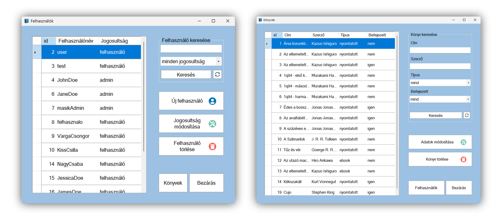

# BOOKS adminisztrációs felület

Egy C# alapú asztali alkalmazás, amelynek fő feladata a [BOOKS](https://github.com/kpisti18/books) házi könyvtár webalkalmazás felhasználóinak kezelése. Továbbá az adatbázisban szereplő könyveken is elvégezhetők bizonyos műveletek.



Az alkalmazás a 2023-as szoftverfejlesztő és –tesztelő képzés záróvizsgájára készült.

## Funkciók

- Felhasználó keresése név és jogosultság alapján
- Új felhasználó felvétele `admin` vagy `felhasználó` jogosultsággal
- Meglévő felhasználók hozzáférési jogosultságának módosítása
- Felhasználók törlése
- Könyv keresése cím, szerző, típus és olvasási állapot szerint
- Felvett könyvek adatainak módosítása és könyvek törlése

## Fejlesztői telepítés

1. Szükséges szoftverek telepítése, ha azok nem állnak rendelkezésre

- [Visual Studio 2022 Community](https://visualstudio.microsoft.com/vs/community/)
- [XAMPP](https://www.apachefriends.org/)

2. Projekt klónozása

```
    git clone https://github.com/orszaczkyanna/WinFormBooks.git
```

3. Adatbázis létrehozása

- XAMPP-ban aktiváld az Apache webszervert és a MySQL adatbázist
- [phpMyAdmin](http://localhost/phpmyadmin) segítségével importáld a `books_database_minta.sql` fájlt a `books` adatbázis létrehozásához

4. Program futtatása

- Nyisd meg a projektet a `WinFormBooks.sln` fájlra kattintva
- Kattints a `Start` gombra a Visual Studio eszköztárán, vagy nyomd meg az `F5` billentyűt

## Használat

### Felhasználók kezelése

- **Felhasználók listája**: Indítás után megjelenik az összes felhasználó, azonosítóval és jogosultsággal együtt. A táblázat oszlopai átméretezhetők, és a tartalom abc sorrendbe rendezhető az oszlopfejlécekre kattintva.
- **Keresés**: Felhasználónév vagy jogosultság alapján lehet szűrni a listát.
- **Új felhasználó hozzáadása**: Megadható felhasználónév, jelszó és jogosultság. Az adatoknak bizonyos kritériumoknak meg kell felelniük.
- **Jogosultság módosítása**: Korábban felvett felhasználó jogosultságát lehet módosítani.
- **Felhasználó törlése**: Kiválasztott felhasználó törlése, ha nincsenek kölcsönvett könyvei.

### Könyvek kezelése

- **Könyvek listája**: Az adatbázisban tárolt könyvek megjelenítése. Rendezhető és szűrhető több szempont szerint.
- **Könyv módosítása**: A kijelölt könyv adatainak megváltoztatása.
- **Könyv törlése**: Kiválasztott könyv törlése.

Az ablakok közötti váltás a `Felhasználók` és `Könyvek` gomb segítségével történik.

## Alkalmazott eszközök, technológiák

- **C#**: Microsoft által fejlesztett erősen típusos objektumorientált programozási nyelv
- **Windows Forms**: A .NET keretrendszer egyik eszköze, amely grafikus felhasználói felület fejlesztésére alkalmas
- **MySQL**: Nyílt forráskódú, relációs adatbázis-kezelő rendszer
- **Visual Studio 2022 Community**: Ingyenes fejlesztőkörnyezet, amely támogatja a C# és .NET használatát
- **XAMPP**: Webszerver-szoftvercsomag, amely tartalmazza az Apache webszervert és a MySQL adatbázist.
- **phpMyAdmin**: Webes felület MySQL adatbázisok kezelésére
- **Figma**: Webalapú, kollaboratív grafikai és UI/UX tervező eszköz

---

További, részletesebb információk elérhetők a [Dokumentáció.pdf](https://github.com/orszaczkyanna/WinFormBooks/blob/master/Dokument%C3%A1ci%C3%B3.pdf) fájlban.
