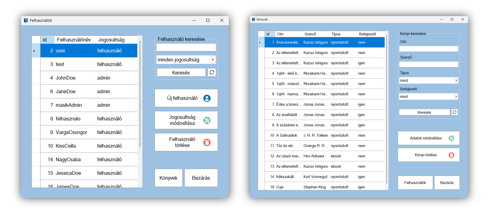

# BOOKS Administration Interface

A C# desktop application for managing users of the [BOOKS](https://github.com/kpisti18/books) home library web application. Additionally, it includes some features for working with books in the database.



The project was developed as part of the 2023 Software Developer and Tester final exam requirements.

The app is only available in Hungarian.

## Features

- Search users by name or role
- Add new users with either `admin` or `user` roles
- Modify access roles of existing users
- Delete users
- Search books by title, author, category, or reading status
- Edit or delete books stored in the database

## Developer Installation

1. Install required software if not already available

- [Visual Studio 2022 Community](https://visualstudio.microsoft.com/vs/community/)
- [XAMPP](https://www.apachefriends.org/)

2. Clone the repository

```
    git clone https://github.com/orszaczkyanna/WinFormBooks.git
```

3. Create the database

- In XAMPP, start the Apache web server and MySQL database
- Use [phpMyAdmin](http://localhost/phpmyadmin) to import the `books_database_minta.sql` file and create the `books` database

4. Run the application

- Open the project by double-clicking the `WinFormBooks.sln` file
- Click the `Start` button in the Visual Studio toolbar or press `F5` to run the program

## Usage

### Managing Users

- **User List**: On startup, all users are displayed with their ID and role. The columns can be resized, and the content can be sorted alphabetically by clicking on the column headers.
- **Search**: Filter the list by username or role.
- **Add New User**: You can specify a username, password, and role. Data must meet certain criteria.
- **Modify User Role**: Change the role of an existing user.
- **Delete User**: Remove a selected user if they have no borrowed books.

### Managing Books

- **Book List**: Displays books stored in the database. Can be sorted and filtered by various criteria.
- **Edit Book**: Modify the details of a selected book.
- **Delete Book**: Remove a selected book from the database.

Switch between the `Users` and `Books` sections using the buttons labeled accordingly.

## Tools and Technologies Used

- **C#**: A strongly-typed, object-oriented programming language developed by Microsoft
- **Windows Forms**: A .NET framework tool used for building graphical user interfaces
- **MySQL**: An open-source relational database management system
- **Visual Studio 2022 Community**: A free development environment supporting C# and .NET
- **XAMPP**: A web server package that includes the Apache web server and MySQL database
- **phpMyAdmin**: A web interface for managing MySQL databases
- **Figma**: A web-based, collaborative design tool for graphic and UI/UX design

---

For more details in Hungarian, please refer to the [Dokumentáció.pdf](https://github.com/orszaczkyanna/WinFormBooks/blob/master/Dokument%C3%A1ci%C3%B3.pdf).
